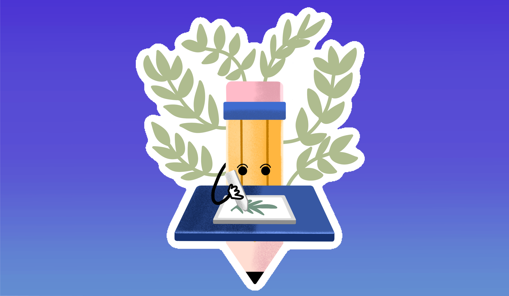
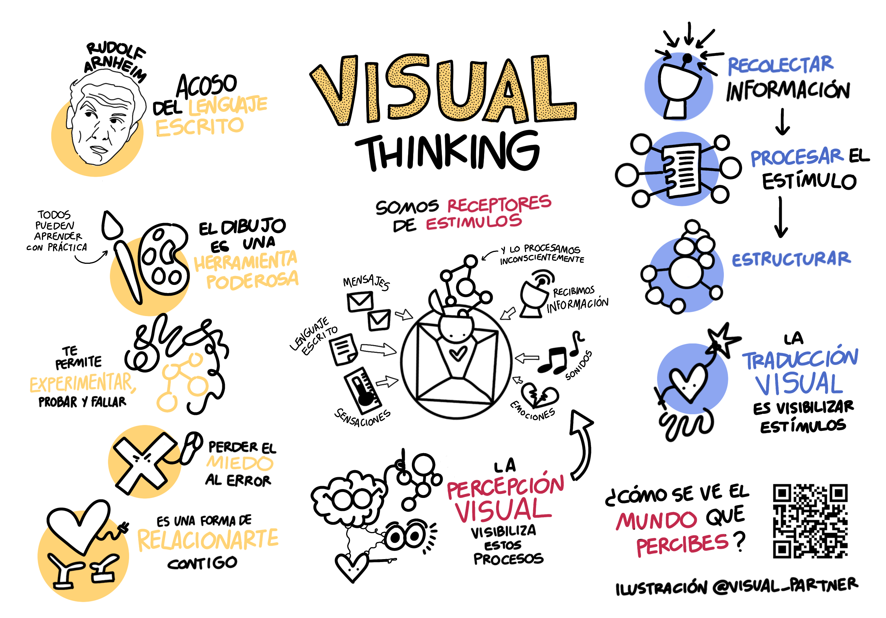

## Parte 3: Representaciones Visuales

### Actividad 7: Fábrica de Zines

Para esta actividad divide una hoja de papel en dos.

`Parte 1: El zine bueno`
1. El primer pequeño cuadernillo de 4 páginas, numéralas y considera que la número 1 es tu portada.
2. Titula la página 2 como **¿Quién soy?**. Divide la página en 6 secciones. Dibuja 6 respuestas concretas al título. Sólo dibujos.
3. La página 3 lleva por título **Cosas importantes que me gusta que las personas conozcan de mi**. Divide la página en 6 secciones y dibuja respuestas concretas. Sólo dibujos.
4. La página 4 nombrala cómo **Reconomientos y logros**. Divide la página en 6 secciones y dibuja respuestas concretas.
5. Esta actividad se trata de dibujar íconos que representen respuestas para ti, trata de hacer los 6, no importa si haces menos.
6. Al final de la página 4 anota tu nombre.
7. La primera página se debe quedar en blanco.

`Parte 2: El zine malo`
1. Toma el segundo cuadernillo y numéralo.
2. En la página 2, secciona en 6 partes iguales, y titula la página como **Cosas que me ponen triste**. Crea un dibujo por sección, sin agregar texto, sólo dibujos.
3. En la página 3, secciona en 6, y titula **Cosas que me dan asco**. Misma actividad.
4. En la página 4 titula **Cosas que me hacen enojar**. Al final incluye tu nombre en alguna esquina. 
5. La portada debe quedarse en blanco.

`Parte 3: Síntesis visual`
1. Toma uno de tus zines.
2. Mira los íconos creados en cada hoja.
3. En la primera página selecciona 2 íconos de cada página y llena la portada de tal forma que acomodes por orden de importancia las ideas plasmadas.
4. Es una portada muy libre, la intención es que describas a la persona que hizo los íconos por medio de la portada que vas a crear. 

### Actividad 8: StarMachine

1.  Encuentra un símbolo para los siguientes instrumentos musicales: star machine, máquina de escribir, marimba, bateria, melódica, y teclado. Pueden ser las iniciales, íconos, figuras, etc.
2. Toma una hoja de papel completa y dos plumones de diferente color.
3. Escucharas la canción en vivo de Starmachine 2000 https://www.youtube.com/watch?v=mf3bhAayHaw, al momento de iniciar, con la mano no dominante irás colocando puntos pequeños conforme va corriendo la música, deja que tu mano te guíe y que la presión de los puntos sea sensitiva al ritmo de la música.
4. Mientras la música y el video van corriendo, con tu mano dominante irás anotando la inicial del instrumento que vaya apareciendo en el video.
5. El objetivo es dibujar el flujo de ritmo que vas escuchando con tu mano no dominante, y al mismo tiempo ir anotando las veces que ves un instrumento musical.
6. Cuenta y agrupa el número de veces que viste cada instrumento.
7. En otra página visualiza dos datos, por un lado la pulsión de tu mano no dominante en la música, por otro el número de veces que captaste un instrumento.

### Actividad 9: Carta de Navegación

1. Toma un tarot, este deben ser las 16 tarjetas con íconos.
2. Coloca una idea referente al visual thinking en cada una de las tarjetas.
3. Juega con las ilustraciones, de tal forma que encuentres las cuatro o cinco ideas que para ti tienen mayor relevancia para definir el pensamiento visual.
4. Tómate tu tiempo y juega con las combinaciones posibles.
5. En una hoja, al centro, incorpora en una sola ilustración los íconos que elegiste.
6. Agrega en texto las ideas que consideres importantes alrededor de tu ilustración principal.
7. Añade nuevos íconos de las tarjetas, o bien los que tu consideres para complementar tu carta de navegación.

Narrativas Visuales ejemplo Spiderman Across the Spiderverse: https://www.youtube.com/watch?v=rj7E5nLMFzA&t=163s

 👈
