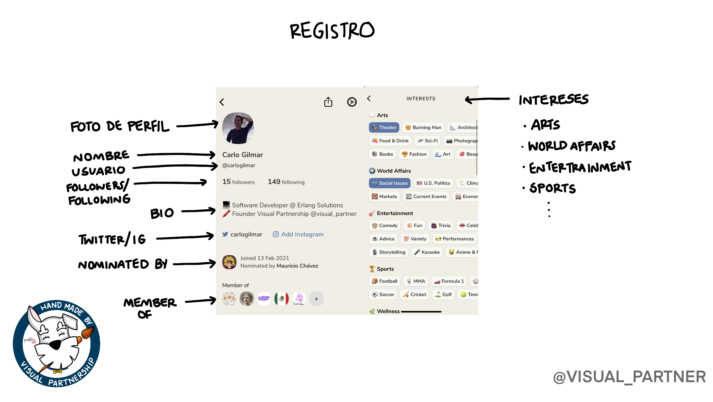
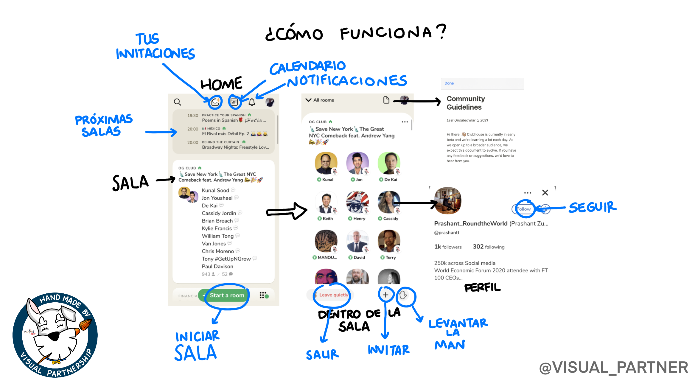
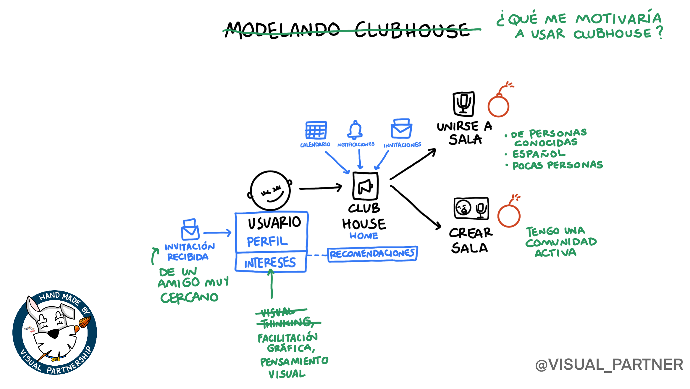
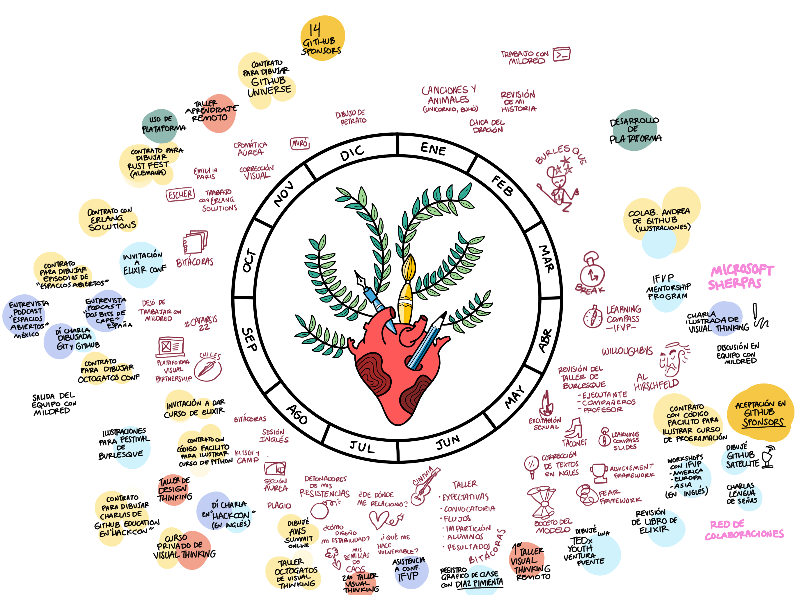

# Version Extendida

El Visual Thinking es una habilidad que nos permite experimentar a través del dibujo. Al término de este taller habrás pasado por tres etapas que fueron diseñadas para mostrarte cómo funcionan los procesos del percepción visual y el trazo:
- En la parte 1 hiciste algunos ejercicios de exploraciones y trazos con la mano no dominante, esto fue para exponerte al miedo a dibujar, y darte herramientas para que desarrolles tu propio trazo y flujo.
- En la parte 2 a través de ejercicios de traducción visual, comenzaste a orientar tu pensamiento hacia un mundo más visual, donde las ideas tiene forma y color.
- En la última parte comenzaste a experimentar algunas formas de estructurar ideas visuales.

El camino de Visual Thinking es de mucha práctica y paciencia, pero es un tiempo invertido del que recibirás grandes beneficios. Aquí te dejo algunas ideas que puedes explorar por tu cuenta.

### Modela la información de una app

1. Toma una app que uses seguido.
2. Comienza a hacer un boceto donde anotes la información que va apareciendo por pantalla.
3. Disecciona los flujos de información dentro de la app.






### Retrospectiva Visual

1. Haz un círculo, y divídelo en 12. Cada parte corresponde a un mes del año.
2. Elige algunos aspectos de tu vida: profesión, vida emocional, vida familiar, estudio, etc.
3. Asígna un color por cada sección del punto anterior.
4. Ahora anota todos los sucesos de cada sección según el mes en que pasaron. Así por todas las secciones que desees abordar.
5. Este ejercicio se trata de vaciar todos los eventos significativos de tu año por sección. Tu mente recordará los más significativos, y tal vez olvidarás otros.
6. Cuando termines, trata de encontrar relación entre los sucesos que pasaron en el mismo mes.
7. Esta es una ilustración de lo que ocurrio en tu año.


### Ilustración de un noema

```
Rayuela: Capítulo 68
[Fragmento - Texto completo.]
Julio Cortázar
Apenas él le amalaba el noema, a ella se le agolpaba el clémiso y caían en hidromurias,
en salvajes ambonios, en sustalos exasperantes. Cada vez que él procuraba relamar las
incopelusas, se enredaba en un grimado quejumbroso y tenía que envulsionarse de cara
al nóvalo, sintiendo cómo poco a poco las arnillas se espejunaban, se iban apeltronando,
reduplimiendo, hasta quedar tendido como el trimalciato de ergomanina al que se le han
dejado caer unas fílulas de cariaconcia. Y sin embargo era apenas el principio, porque en
un momento dado ella se tordulaba los hurgalios, consintiendo en que él aproximara
suavemente sus orfelunios. Apenas se entreplumaban, algo como un ulucordio los
encrestoriaba, los extrayuxtaba y paramovía, de pronto era el clinón, la esterfurosa
convulcante de las mátricas, la jadehollante embocapluvia del orgumio, los esproemios
del merpasmo en una sobrehumítica agopausa. ¡Evohé! ¡Evohé! Volposados en la cresta
del murelio, se sentían balpamar, perlinos y márulos. Temblaba el troc, se vencían las
marioplumas, y todo se resolviraba en un profundo pínice, en niolamas de argutendidas
gasas, en carinias casi crueles que los ordopenaban hasta el límite de las gunfias.
FIN
```

Este fragmento de Rayuela usa un lenguaje glíglico, es decir, un juego de palabras inexistentes. 

1. Toma tres ideas del fragmento anterior.
2. Ilustra cada una en la misma página.
3. Estás ilustrando palabras inexistentes. Se trata de ser libre imaginando.

### Mi Diccionario Visual

1. Elige un museo de tu ciudad.
2. Lleva una libreta y algo para hacer anotaciones.
3. Recorre el museo, mira cuidadosamente el contenido, y aquello que te llame la atención dibújalo.
4. No importa si tus aproximaciones no son exactas, se trata de ir reconociendo aquellos símbolos a los que reaccionas más para crecer tu diccionario visual.
5. Una vez terminada tu visita, toma tus anotaciones y conviértelas en íconos, tal vez solo te dan ideas nuevas para buscar otras ilustraciones para incorporar a tu diccionario.

### Chisme Visual

1. Haz una cita con alguien de confianza.
2. Pide que te cuenten algo.
3. En una hoja de papel dibuja todo lo que vayas captando, procura no usar texto.
